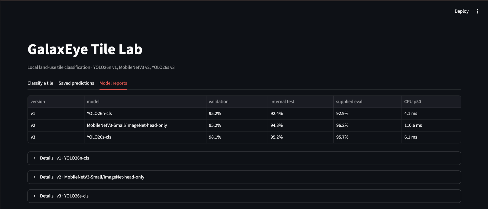

# GalaxEye tile classifier

This repository contains three image classifiers trained on the dataset supplied for the GalaxEye take-home. The dataset is not included. The trained weights are included, so you can install the project and run inference without the dataset.

The models classify 64×64 RGB tiles into seven land-use classes. The local service accepts a tile, runs the selected model on CPU, and stores the prediction and a local copy of the image. FastAPI provides the API. Streamlit provides the viewer.



## Install

Install Python 3.12 and `uv`, then run:

```bash
uv sync --locked
```

The checkpoints and their manifests are in the model version directories. Inference uses those local files and does not download a model. Package installation may need internet access unless the Python packages are already cached.

## Run the app

Open three terminals in the project directory.

Start the inference service:

```bash
uv run --offline uvicorn galaxeye.inference_api:app --host 127.0.0.1 --port 8001
```

Start the API:

```bash
uv run --offline uvicorn galaxeye.api:app --host 127.0.0.1 --port 8000
```

Start the viewer:

```bash
uv run --offline streamlit run src/galaxeye/ui.py --server.address 127.0.0.1 --server.port 8501
```

Open <http://127.0.0.1:8501> and upload a PNG tile. Choose one model or compare all three. The API documentation is at <http://127.0.0.1:8000/docs>.

To classify a local tile from the command line, replace the placeholder with a PNG path you have permission to use:

```bash
curl --form 'file=@/path/to/tile.png' 'http://127.0.0.1:8000/classify?version=v3'
```

The result includes the predicted class, the seven model scores, a review flag, the model version, and inference time. The app stores uploaded images under a content hash and records their local paths in SQLite. It binds to loopback by default.

## Check the local models

With both FastAPI services running, use the included smoke check:

```bash
uv run --offline python scripts/verify_runtime.py
```

The script creates a synthetic 64×64 PNG in memory and sends it through each model. It checks the API response, saved result, retry behavior, and image retrieval. The synthetic tile checks that the service runs. It does not measure classification accuracy.

The model reports are available in the viewer and under `artifacts/v1/`, `artifacts/v2/`, and `artifacts/v3/`. The reported test results come from the supplied dataset. They are small-sample estimates and do not establish performance on other sensors, seasons, or locations.

## Retrain or reevaluate

The source dataset is not in this repository. To prepare a new split, set `GALAXEYE_TRAINING_IMAGES` to a local directory with one subdirectory per class, then run:

```bash
uv run python scripts/prepare_data.py
uv run python scripts/train_v1.py
uv run python scripts/train_v2.py
uv run python scripts/train_v3.py
```

The training directory must contain the same labeled examples used for this take-home. Training may download pretrained initialization weights if they are not cached locally. Inference from the included trained checkpoints does not need those initialization files.

To reproduce evaluation, also set `GALAXEYE_EVAL_IMAGES` to the local evaluation image directory and `GALAXEYE_EVAL_LABELS` to its local label table. Then run:

```bash
uv run python scripts/evaluate.py
```

The evaluator uses the validation split to choose each review threshold. It reads the internal test and supplied evaluation labels only for reporting.

## Model versions

| Version | Model | Input size |
| --- | --- | ---: |
| v1 | YOLO26n classification | 128 px |
| v2 | MobileNetV3-Small | 224 px |
| v3 | YOLO26s classification | 128 px |

All model scores are uncalibrated softmax outputs. A review flag is a triage signal, not a claim that a prediction is correct.

## Local data and generated files

The raw dataset, split copies, prediction database, uploaded images, training runs, and design documents stay outside the submitted commit. `.gitignore` excludes them. The repository contains the trained model checkpoints and the manifests and metrics required to run the app and view reports.

To build a local archive of the runnable project and model files, run:

```bash
uv run --offline python scripts/package_submission.py
```
